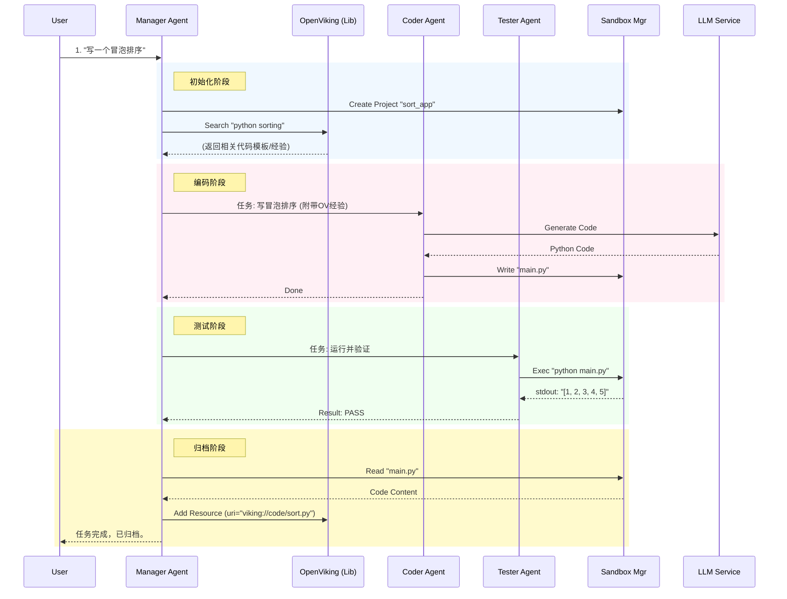

# Agent Team 本地 Demo 需求与设计文档

## 1. 项目背景与目标
在本地 Mac 环境中，使用轻量级方案模拟本地实现 Agent Team 核心架构。
通过 **`uv`** 管理 Python 环境，**Restate** 管理编排，**OpenViking** 管理知识，验证 **Agent Team (Manager/Coder/Tester)** 的协同工作流。

**核心验证点**：
1.  **Restate 编排能力**：验证 Agent 间的 RPC 调用和状态保持。
2.  **OpenViking 知识流转**：验证“知识检索 -> 代码生成 -> 知识归档”的闭环。
3.  **Sandbox 模拟**：验证“共享文件系统 + 远程命令执行”的协作模式。

---

## 2. 技术栈选型 (Local Stack)

| 组件 | 选型 | 说明 |
| :--- | :--- | :--- |
| **包管理器** | **uv** | 极速 Python 包管理与虚拟环境管理 |
| **编排引擎** | **Restate (Binary)** | 本地启动 `restate-server`，处理服务间通讯 |
| **知识库** | **OpenViking (Lib)** | 本地运行库，数据存本地磁盘，Embedding 调 **火山引擎** |
| **LLM** | **Anthropic SDK** | 代码库用 `anthropic`，但配置 **自定义 Endpoint** 和模型 |
| **沙箱** | **Local Dir + Subprocess** | 在 `/tmp` 下创建目录模拟 Pod，用子进程模拟执行 |
| **语言** | Python 3.11+ | - |

---

## 3. 详细设计

### 3.1. 项目结构 (uv project)

```text
lbg-demo/
├── .env                    # 敏感配置 (API Keys, Endpoints)
├── pyproject.toml          # uv 依赖定义
├── uv.lock                 # 版本锁定
├── src/
│   ├── __init__.py
│   ├── config.py           # 配置加载
│   ├── infra/              # 基础设施层 (模拟 Body World)
│   │   ├── llm.py          # LLM Client 封装
│   │   ├── ov_client.py    # OpenViking 封装
│   │   └── sandbox.py      # Sandbox Manager (Restate Service)
│   ├── agents/             # 智能体层 (模拟 Brain World)
│   │   ├── manager.py      # Manager Agent
│   │   ├── coder.py        # Coder Agent
│   │   └── tester.py       # Tester Agent
│   └── main.py             # 启动入口
└── data/                   # OpenViking 本地数据存储 (自动生成)
```

### 3.2. 模块功能定义

#### **A. 基础设施层 (Infra)**

1.  **`LLMClient` (Wrapper)**
    *   **配置**：从 `.env` 读取 `LLM_BASE_URL`, `LLM_API_KEY`, `LLM_MODEL_NAME`。
    *   **功能**：提供统一的 `chat(system, user)` 接口。
    *   **特殊处理**：确保 Anthropic SDK 能正确请求非 Claude 模型（通常需要调整 header 或忽略某些参数）。

2.  **`OVClient` (Wrapper)**
    *   **配置**：从 `.env` 读取 `VOLCENGINE_API_KEY`, `DOUBAO_EMBEDDING_MODEL`。
    *   **初始化**：使用 `ov.SyncOpenViking`，配置本地路径 `./data/ov_store`。
    *   **功能**：
        *   `init()`: 初始化/加载索引。
        *   `add(content, uri)`: 存入知识。
        *   `retrieve(query)`: 检索知识（返回 L1 摘要）。

3.  **`SandboxManager` (Restate Service)**
    *   **定位**：模拟云端的 Sandbox Service。
    *   **状态**：无状态（操作本地文件系统）。
    *   **接口**：
        *   `create_project(project_id)`: 在 `/tmp/lbg/{project_id}` 创建目录。
        *   `write_file(project_id, filename, content)`: 写入代码。
        *   `read_file(project_id, filename)`: 读取代码/日志。
        *   `exec(project_id, command)`: 运行命令（如 `python main.py`），返回 `stdout/stderr`。

#### **B. 智能体层 (Agents - Restate Virtual Objects)**

1.  **`ManagerAgent`**
    *   **角色**：总控。
    *   **流程**：
        1.  调用 `Sandbox.create_project`。
        2.  调用 `OVClient` 检索是否有类似任务经验。
        3.  调用 `CoderAgent`。
        4.  调用 `TesterAgent`。
        5.  如果成功，调用 `OVClient` 归档代码；如果失败，让 Coder 重试（最多 3 次）。

2.  **`CoderAgent`**
    *   **角色**：执行者。
    *   **输入**：需求描述 + 参考经验（来自 OV）。
    *   **动作**：调用 LLM 生成代码 -> 调用 `Sandbox.write_file`。

3.  **`TesterAgent`**
    *   **角色**：质检者。
    *   **动作**：调用 `Sandbox.exec` 运行代码 -> 分析输出 -> 返回 Pass/Fail。

---

## 4. 数据流与交互图 (Sequence)



---

## 5. 环境配置清单 (.env)
已经准备好的环境配置项

```ini
# --- Restate ---
RESTATE_URL=http://localhost:8080

# --- LLM (Custom Anthropic Compatible) ---
# 用于 Agent 思考 (Manager/Coder/Tester)
LLM_BASE_URL=https://api.your-provider.com/v1
LLM_API_KEY=sk-xxxxxxxxxxxxxxxx
LLM_MODEL_NAME=claude-3-5-sonnet-20240620

# --- OpenViking (Volcengine Configuration) ---
# 1. 本地存储路径
OV_DATA_PATH=./data/ov_store

# 2. 火山引擎通用配置
# 豆包 API Key (通常 Embedding 和 VLM 共用一个 Key，也可以分开配置)
VOLCENGINE_API_KEY=xxxxxxxx-xxxx-xxxx-xxxx-xxxxxxxxxxxx
# 火山引擎 API Base URL (通常是 ark.cn-beijing.volces.com)
VOLCENGINE_API_BASE=https://ark.cn-beijing.volces.com/api/v3

# 3. Embedding 模型配置 (用于文本向量化)
# 模型 Endpoint ID (例如: ep-20250217xxxxxx-xxxxx)
DOUBAO_EMBEDDING_MODEL=ep-xxxxxxxx-xxxxx
# 向量维度 (豆包通常是 1024 或 768，需确认模型规格)
DOUBAO_EMBEDDING_DIM=1024

# 4. VLM 模型配置 (用于多模态理解/图片索引)
# 模型 Endpoint ID (例如: ep-20250217xxxxxx-xxxxx)
# 如果不需要处理图片，这个可以留空，但在代码里要处理空值情况
DOUBAO_VLM_MODEL=ep-xxxxxxxx-xxxxx
```

---

## 6. 执行计划

1.  **环境初始化**：使用 `uv init` 创建项目，添加依赖 (`restate-sdk`, `anthropic`, `openviking`, `python-dotenv`)。
2.  **基础设施实现**：编写 `src/infra` 下的 LLM、OV 和 Sandbox 代码。
3.  **Agent 实现**：编写 `src/agents` 下的业务逻辑。
4.  **联调**：启动 Restate，运行 `uv run src/main.py`，发送 curl 请求测试。

## 注意

需要打好日志，方便调试